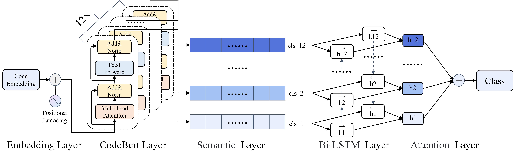

The source code and dataset for "EL-CodeBert: Better Exploiting CodeBert to Support Source Code-Related Classification Tasks"



# How to run

1. Before run the main.py, you need to download the CodeBert model in 'codebert' file fold.

2. Then you need first fine-tune the CodeBert, like:

```python
classifier = CodeBertClassifier(        
    model_path='./codebert', #CodeBert     
    tokenizer_path='./codebert', #CodeBert        
    max_len=256, #Maximum length of input
    n_classes=19, #Number of classes
    epochs=5, #Epoch
    model_save_path='./save/code_codebert.pt', #Where to save model       
    batch_size=64, #Batch Size
    learning_rate=2e-5) #Learning Rate
```

Run main.py

3. Thus, you get the fine-tuned CodeBert, and the you need fine-tune the others, like:

```python
classifier = EL_CodeBert(        
	model_path='./codebert',        
	tokenizer_path='./codebert',        
	pretrained_model='./save/code_codebert.pt',        
	max_len=256,        
	n_classes=19,        
	epochs=15,        
	model_save_path='./save/code_codebertrnnatten.pt',        
	batch_size=64,        
	learning_rate=5e-4)
```

Run main.py

# How to predict

If you want to predict and visualize single data, modify single.py and run it.

